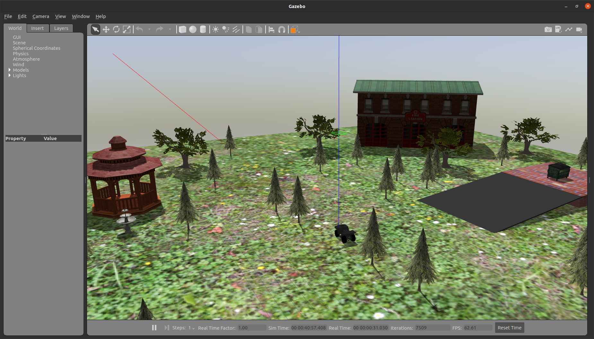
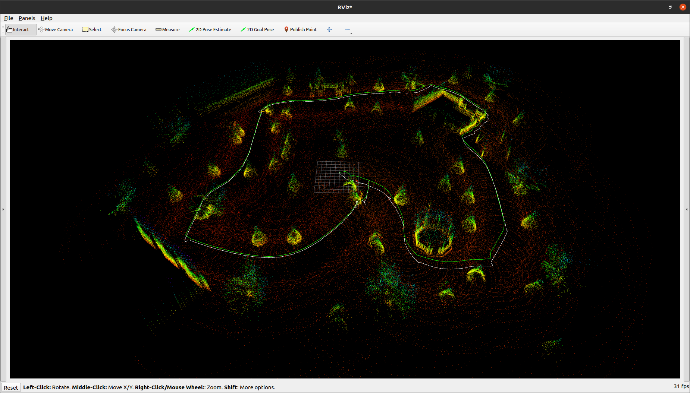

# lonewolf
Repository for the bachelor thesis: ROS simulated world for ATV and finding optimal SLAM algorithm for generated point cloud

**If you are running this on NVIDIA AGX Xavier, head over to the .devcontainer for the setup guide.**

## Prerequisites
- ROS 2 Foxy installed on Ubuntu Linux 20.04 or newer
- You have installed Gazebo on your computer: ```sudo apt install gazebo11```
- You have installed the required packages: 
  - Ceres-solver: 
  ```
    # Install Dependencies
    sudo apt update -y && sudo apt upgrade -y

    sudo apt-get install libgoogle-glog-dev libgflags-dev -y
    sudo apt-get install libatlas-base-dev -y
    sudo apt-get install libeigen3-dev -y
    sudo apt-get install libsuitesparse-dev -y

    # Download
    cd /tmp
    CERES_VERSION="ceres-solver-2.0.0"
    CERES_ARCHIVE="$CERES_VERSION.tar.gz"
    wget http://ceres-solver.org/$CERES_ARCHIVE
    tar xfv $CERES_ARCHIVE

    # Install
    cd $CERES_VERSION
    mkdir build
    cd build
    NUM_CPU_CORES=$(grep -c ^processor /proc/cpuinfo)
    cmake ..
    cmake --build . -j $NUM_CPU_CORES

    sudo apt install checkinstall libssl-dev -y
    sudo checkinstall --pkgname ceres-solver
  ```
  - [g2o](https://github.com/RainerKuemmerle/g2o)
    ```
      git clone --recursive git@github.com:RainerKuemmerle/g2o.git
      cd g2o
      mkdir build
      cd build
      cmake ../
      sudo make install
    ```
 
  ```
  sudo apt install ros-foxy-gazebo-ros-pkgs
  sudo apt install ros-foxy-velodyne 
  sudo apt install ros-foxy-teleop-twist-keyboard
  sudo apt install ros-foxy-ros2-control
  sudo apt install ros-foxy-ros2-controllers
  sudo apt install ros-foxy-velodyne-gazebo-plugins
  ```
- You also need to install gtsam. 
  ```
  sudo add-apt-repository ppa:borglab/gtsam-release-4.0
  sudo apt update
  sudo apt install libgtsam-dev libgtsam-unstable-dev
  ```

Now you can download the simulator to your ros2 workspace. If you haven't set up a ros2 workspace before, you can follow [this tutorial](https://docs.ros.org/en/foxy/Tutorials/Workspace/Creating-A-Workspace.html).
```
source opt/ros/foxy/setup.bash
cd ~/ros2_ws/src
git clone git@github.com:sigridmellemseter/lonewolf.git
cd ~/ros2_ws
colcon build
```
Place the models in the folder gazebomodels inside the .gazebo/models/ folder. 


### Launching the simulator
Open a terminal and write the following. 
```
source opt/ros/foxy/setup.bash
cd ~/ros2_ws
source install/setup.bash
ros2 launch atv_pkg texas_world.launch.py
```
You should now see the ATV and the world in Gazebo. 



### Steering the ATV

```
source opt/ros/foxy/setup.bash
ros2 run teleop_twist_keyboard teleop_twist_keyboard
```
This application tells you how to steer the robot. 

### How view point cloud in rviz2: 
While the simulator is running, open a new terminal and run rviz2 
```
source opt/ros/foxy/setup.bash
rviz2 
```

In rviz2 you have to define the correct frame. Write `velodyne` as the Fixed Frame under Global Options. 

Now you have to add the PointCloud2 in rviz: 
- Click Add in the bottom left corner 
- Choose By Topic 
- Choose PointCloud2 under /points_raw

Now you should see the point cloud in rviz. To get a better visual choose the Style "Flat Squares", Size (m) to 0.03 and set Color Transformer to "AxisColor"

### Launching SLAM 
While the simulator is running, open a new terminal and write the following. 
```
source opt/ros/foxy/setup.bash
cd ~/ros2_ws
source install/setup.bash
ros2 launch scanmatcher lio_bigloop.launch.py
```
You can also view the maps in rviz2. 
- Open rviz2 as described above 
- Set the fixed frame to `map` 
- Add the topics `/map`, `/path`, `/modified_map` and `/modified_path`. 
  
To see the data more clearly, you can choose the following styles: 
- `/map` : Flat Squares, Size (m) to 0.03, Color Transformer to AxisColor
- `/path`: Color white
- `/modified_map`: Flat Squares, Size (m) 0.03, Color Transformer to ? 
- `/modified_path`: Color green




